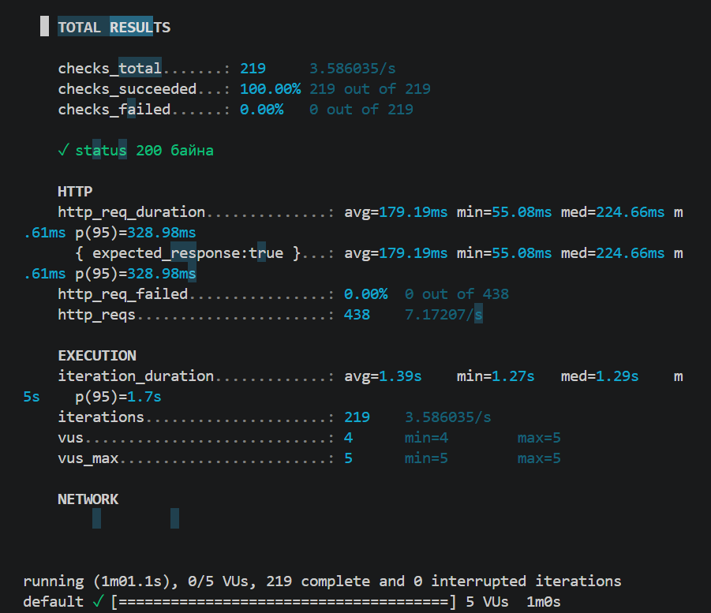
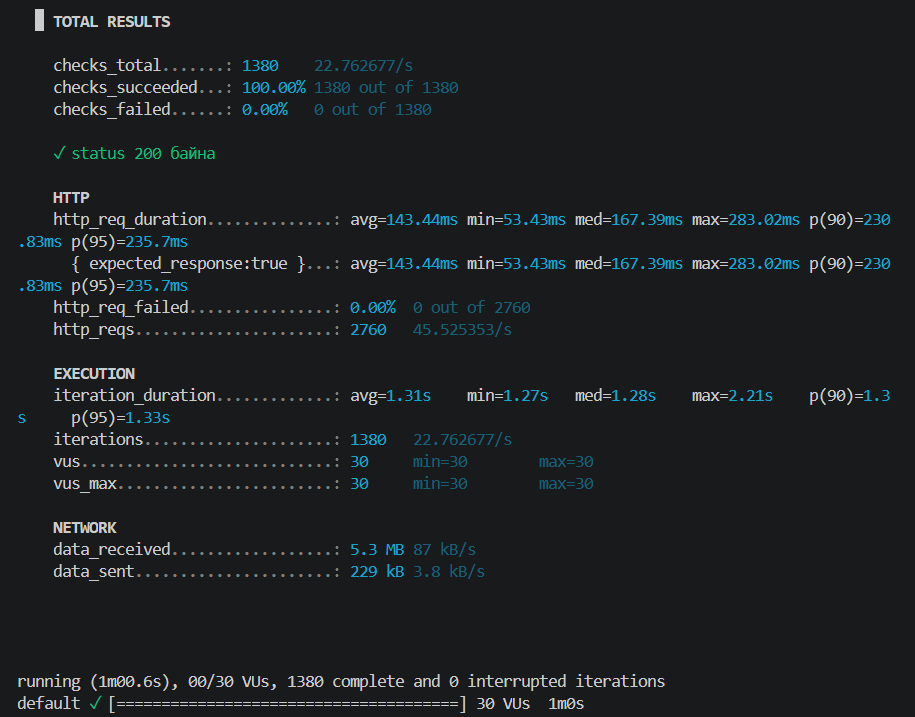
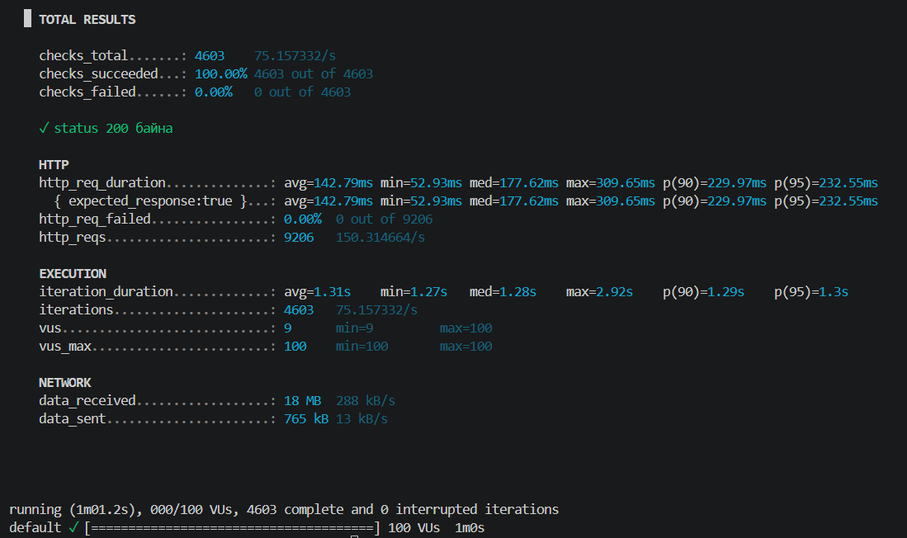

Шалгалтын үр дүн:

SLO threshold-ийг бодит скрипт дээр давхар шалгасан. Эхлээд `script-pass.js` дотор p(95)<470ms threshold-той script ажиллуулахад p95 latency нь тогтоосон босгоос доогуур гарч PASS болсон. Дараа нь `script-fail.js` дотор threshold-ийг санаатайгаар хэт хатуу (p(95)<50ms) болгож шалгахад систем шаардлагыг хангаж чадалгүй `ERRO[...] thresholds on metrics 'http_req_duration' have been crossed` гэсэн алдаа зааж FAIL болсон нь k6-ийн threshold мониторинг зөв ажиллаж байгааг баталгаажуулсан.

Бүтэн гаралтын файлууд:
- PASS (p(95)<470): [results/threshold-pass.txt](results/threshold-pass.txt)
- FAIL (p(95)<50): [results/threshold-fail.txt](results/threshold-fail.txt)
- Stages туршилт: [results/run-stages.txt](results/run-stages.txt)

*** Туршилтын ажлын дүгнэлт:

Энэ лабораторийн ажлаар test.k6.io системд виртуал хэрэглэгчийн хандах тоог 5, 30, 100 VU гэсэн 3 түвшинд харьцуулан туршиж, нэмэлтээр шат дараатай ачаалал өгөх stages туршилт хийлээ. Виртуал хэрэглэгчдийн тоо өсөх тусам секундэд хийгдэх хүсэлтийн тоо буюу throughput шугаман хэлбэрээр өсөж, 5 VU үед 7.12 req/s, 30 VU үед 42.98 req/s, 100 VU үед 139.37 req/s хүрч нэмэгдсээр байсан. Хариу өгөх хугацааны хувьд (p95 latency) 5 VU үед 313.31ms, 30 VU үед 262.36ms, 100 VU үед 309.68ms байсан ба ачаалал ихсэхэд latency нэг их хоцролгүйгээр харьцангуй тогтвортой түвшинд хадгалагдлаа. Мөн 5→30→100→0 VU хүртэл шат дараатайгаар ачаалал өсгөж бууруулах stages туршилтын үед ч гэсэн систем тогтвортой ажилласныг ажиглалаа. Нийт туршилтын явцад ямар нэгэн HTTP алдаа гараагүй тул алдааны хувь 0.00% байж, статус 200 төлөвтэй байлаа. SLO-ийн хувьд baseline p95 = 313.31ms-ийг 1.5 коэффициентээр үржүүлж, 470ms-ийг threshold болгон тогтоосон бөгөөд энэ threshold-той скрипт амжилттай PASS болсон. Харин threshold-ийг санаатайгаар хэт хатуу (p(95)<50ms) болгоход систем шаардлагыг хангаж чадалгүй FAIL төлөвт шилжсэн нь k6-ийн threshold мониторинг зөв ажиллаж байгааг баталгаажуулсан. Ингэснээр SLO тохиргоо зөвхөн онолын хувьд бус, бодит скрипт дээр давхар шалгагдсан болно. Тиймээс туршилтын үр дүнгээс харахад уг сервер дундаж болон түүнээс дээш хэмжээний зэрэгцээ ачааллын үед ямар нэг уналтгүйгээр найдвартай боловсруулж чадах болохыг харуулж байна. Дүгнэж хэлбэл, систем нь тавьсан SLO шаардлагыг хангаж, тогтвортой, найдвартай ажиллаж байгааг энэхүү лабораторийн ажлын үр дүн баталгаажуулж байна.

## Screenshots

